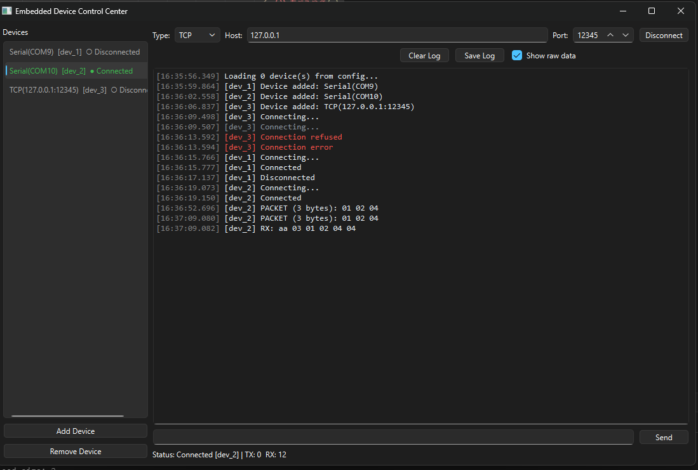

# Embedded Device Control Center (EDCC)

**A professional desktop application for discovering, managing, monitoring, and communicating with embedded devices.**

[](LICENSE)
[](https://www.qt.io)
[](https://github.com/rezamehr/Embedded-Device-Control-Center/releases)
[]()

---

## Overview

**EDCC** is an industrial-style desktop tool for engineers working with microcontrollers (STM32, ESP32, and similar devices).

It provides multi-device management over **Serial** and **TCP**, real-time logging, persistent configuration, and a packet parser foundation for structured protocols.

---

## Features (v1.5.0)

- Multi-device manager (add / remove / select devices)
- Serial communication (`QSerialPort`)
- TCP client communication (`QTcpSocket`)
- Multi-threaded I/O (Worker Object + `QThread`)
- Centralized logger with log levels
- JSON configuration (save / load devices)
- Packet parser:
  - Frame: `START (0xAA) + LENGTH + PAYLOAD + CHECKSUM`
- Show / hide raw data in log view
- TX / RX counters
- Clear log and save log to file
- Unit tests for protocol and JSON config

---

## Screenshots

---

## Roadmap

| Version | Features | Status |
|---------|----------|--------|
| **v1.0** | Device Manager, Serial, TCP, Logger, JSON Config | ✅ Released |
| **v1.5** | Multi-threaded Communication, Packet Parser, Tests | ✅ Released |
| **v2.0** | Firmware Updater (Bootloader support) | Planned |
| **v3.0** | Real-time Charts, Alarm System | Planned |
| **v4.0** | Plugin Architecture, MQTT, CAN | Planned |

---

## Architecture

EDCC follows a clean layered architecture:

- **Application Layer** – UI (`MainWindow`)
- **Core Layer** – `Device`, `DeviceManager`, interfaces
- **Communication Layer** – Serial, TCP, Worker, Packet Parser
- **Logging Layer** – centralized `Logger`

More details: [`docs/architecture.md`](docs/architecture.md)

---

## Requirements

- Qt 6.11 or later
- CMake 3.21+
- C++17 compiler (MSVC 2022 / GCC / Clang)
- Modules: `Widgets`, `Network`, `SerialPort`, `Test` (for unit tests)

---
## Bootloader Protocol

EDCC uses a simple framed protocol to update firmware on target devices
(STM32 and similar MCUs).

Full specification, command list, and request/response examples:

➡️ **[docs/bootloader_protocol.md](docs/bootloader_protocol.md)**

### Firmware Update

1. Connect the device (Serial or TCP)
2. Put the MCU into bootloader mode
3. Select a `.bin` file in the Firmware Update panel
4. Start the update (Erase → Write → Verify → Jump)

Protocol details: [Bootloader Protocol v1.0](docs/bootloader_protocol.md)

## Build Instructions

```bash
git clone https://github.com/rezamehr/Embedded-Device-Control-Center.git
cd Embedded-Device-Control-Center

cmake -B build -DCMAKE_BUILD_TYPE=Release -DEDCC_BUILD_TESTS=ON
cmake --build build

Run unit tests
Bashctest --test-dir build --output-on-failure

Download
A ready-to-run Windows x64 build is available on the Releases page:
➡️ Latest Release

Download the ZIP
Extract
Run EDCC.exe

Project Structure
textEDCC/
├── src/
│   ├── app/               # UI
│   ├── core/              # Device, DeviceManager, interfaces
│   ├── communication/     # Serial, TCP, Worker, Parser
│   ├── logging/           # Central logger
│   └── utils/             # JSON config helpers
├── tests/                 # Qt Test unit tests
├── docs/                  # Architecture and documentation
└── CMakeLists.txt

License
This project is licensed under the MIT License.
See LICENSE for details.

Author
Reza Mehrabani
Embedded Systems Engineer
